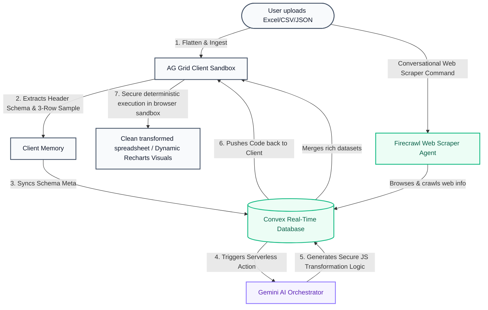

<div align="center">
  
  <h1>Catalyst — The Conversational Data Agent</h1>
  
  <p align="center">
    
    
    
    
    
  </p>
</div>

### Conversational Spreadsheet Intelligence

Catalyst is a comprehensive data analytics platform that allows you to interact with complex spreadsheets using pure natural language. Built for speed, security, and mathematical precision, Catalyst bridges the gap between raw data and actionable insights through an advanced multi-agent architecture.

---

## Why Catalyst?

Standard LLM chat platforms (like raw ChatGPT or Claude threads) are highly probabilistic and fail at precise spreadsheet operations because of three key limitations: **data privacy leaks**, **context token limits**, and **mathematical hallucinations** (LLMs do not calculate averages or growth curves; they simply guess the next word based on probability).

Here is how Catalyst's **Schema-First Client Sandbox** compares:

| Feature Dimension | Traditional AI Chat Thread | The Catalyst Protocol |
| :--- | :--- | :--- |
| **Mathematical Precision** | ❌ **High Hallucination**. Approximates sums, counts, and financial formulas probabilistically. | 🟢 **100% Deterministic**. Runs exact generated JavaScript code in a client-side execution sandbox. |
| **Data Privacy** | ❌ **No Control**. Uploads your entire raw CSV/Excel contents to third-party AI cloud models. | 🟢 **AI Schema-First Privacy**. Raw datasets are stored securely in your private Convex database. Only the table headers and a tiny 3-row sample are sent to the AI. |
| **Dataset Size Limits** | ❌ **Strict Limits**. Crashes or runs out of context window when analyzing datasets over 5,000 rows. | 🟢 **Sub-Second Speed**. Processes spreadsheets with 10,000+ rows instantly via AG Grid browser memory. |
| **Web Data Augmentation** | ❌ **Stale Data**. Restated static data limited to LLM training cutoff. | 🟢 **Live Web Scraping**. Automated search agent (Firecrawl) queries the web and injects live info to sheets. |

---

## The Engine: Hybrid Agentic Architecture

Catalyst uses a unique **Schema-First Code Generation** strategy to solve the most common problems in AI data analysis: token limits, privacy, and hallucinations.

### Interactive Data Flow



### How it Works:
1.  **Context Optimization**: Instead of sending your entire dataset to the LLM, Catalyst only sends the **Table Schema** (columns/types) and a tiny 3-row sample. This reduces token usage by 99% and ensures absolute data privacy.
2.  **Logic Generation**: The AI (Gemini) acts as a Senior Software Engineer, generating high-performance **JavaScript Code** designed to perform the requested transformation or analysis.
3.  **Client-Side Execution Sandbox**: The generated code is executed securely in the **User's Browser**. This allows Catalyst to process millions of rows instantly without the raw data ever leaving your machine.
4.  **Mathematical Precision**: Since the final result is calculated by a deterministic JavaScript engine rather than a probabilistic LLM, Catalyst provides **zero-hallucination accuracy** for all mathematical queries.

---

## Core Features

-   **Natural Language Workspace**: Ask complex questions like *"What is the average revenue by region in Q3?"* and get instant results.
-   **Smart Data Transformations**: Clean, format, and filter massive datasets by simply describing what you want to achieve.
-   **Interactive AG Grid Integration**: View your data in a premium, enterprise-grade grid with real-time sync via Convex.
-   **Automated Dashboards**: Generate "Blueprint Dashboards" instantly. The AI proposes layouts and charts which are then rendered live against your data.
-   **Universal Versioning**: Track every change and transformation. Preview AI-proposed edits in Amber Mode before applying them.

---

## The Catalyst Protocol: Agent Capabilities

Catalyst operates under a state-of-the-art analytical architecture. It supports a full suite of interactive, context-aware agent behaviors:

| Capability | Mechanic | Query Example | Expected Outcome |
| :--- | :--- | :--- | :--- |
| **Conversational Analytics** | Zero-Formula Q&A | *"What is the total sales? Which country had the highest volume?"* | Narratives with precise mathematical aggregates compiled instantly. |
| **In-Chat Visualizations** | Inline Thread charts | *"Show me a quick scatter plot comparing volume vs. shipping costs."* | Embedded live interactive Recharts (Line, Area, Composed, Scatter, etc.) right in the chat feed (using `TrendingUp` styling). |
| **Strategic Dashboarding** | Custom Multi-Grid | *"Generate an executive report with a revenue trend and small categories below."* | Multi-chart executive layouts complete with corporate advisory summaries. |
| **Web-to-Sheet Scraper** | Live Scraper (Firecrawl) | *"Find stock prices and CEOs for company names in Column A."* | AI crawls the web in real-time, extracts fresh information, and merges it back into your grid. |
| **The Transformation Engine** | Amber Preview | *"Capitalize names in Column B and fill missing values with the average."* | Enters Preview Mode, highlights changes in amber, and updates cell values upon approval. |
| **Self-Healing Sandbox** | Auto-correcting typos | [AI spelling typos like `avgOrder` instead of `avgOrderValue`] | Compiler intercepts errors, declares variables dynamically, self-heals, and renders charts. |
| **Cross-Sheet Intelligence** | Multi-Tab Relational Logic | *"Compare 'Inventory' sheet with 'Orders'. Which products have highest demand?"* | Resolves complex lookups and joins across sheet tabs in the same workbook. |
| **Analytical Memory** | 10-turn Rearview Mirror | *"Filter results for Q4. [Follow-up] Show me the top 5 customers from them."* | Retains context for follow-up questions, understanding pronouns like "them", "those", or "that". |
| **Dynamic Sheet Compilation** | Conversational Creation | *"Create a new tab called 'Q4 Targets' with mock target revenues."* | Generates the data array, appends the tab to the workbook, and shifts grid focus. |
| **Cell Highlighting** | Visual Conditioning | *"Highlight rows where Country is USA in yellow and status Shipped in green."* | Evaluates conditional statements in real-time and injects styled cell metadata. |
| **Undo/Redo Engine** | State-Snapshot rollback | *"Undo that transform. [Follow-up] Actually, redo it."* | Takes full state snapshots before any transformation to guarantee zero data loss. |

---

## Security & Privacy

Catalyst is designed with a secure, **privacy-first** hybrid architecture:
- **Private Cloud Storage**: Your raw datasets are uploaded and securely stored in your private Convex cloud database instance, ensuring persistence and rapid grid loading across sessions.
- **Client-Side Sandbox Execution**: All data mutations, formulas, and code executions run securely inside your browser's local sandbox memory, keeping raw calculations isolated.
- **Schema-Only AI Communication**: We **never** upload your full datasets to third-party AI models (Google Gemini). The compiler only receives your table schema (headers and types) and a tiny 3-row sample to safely generate the transformation script.
- **Zero Model Training**: Your workspace is completely private; neither Convex nor third-party models retain or use your analytical results for training.

## Supported Formats & Exporting

Catalyst handles seamless import and export transitions across three major data structures:

*   **Excel (`.xlsx`, `.xls`)**: Import multi-sheet workbooks and export clean, structured Excel grids with original relational integrity intact.
*   **CSV (Comma-Separated Values)**: High-speed ingestion of standard tabular documents and rapid export capability.
*   **JSON (JavaScript Object Notation)**:
    *   **Auto-Flattening Import**: Catalyst automatically parses complex, nested JSON objects or arrays and normalizes them into clean relational 2D grids with headers.
    *   **Structured Export**: Download your final mutated workbook instantly as clean, modular JSON.

---

## Tech Stack

-   **Frontend**: Next.js 15 (Turbopack), Tailwind CSS, Framer Motion.
-   **Backend**: Convex (Real-time DB, File Storage, Serverless Actions).
-   **Authentication**: Stack Auth (Cloud-native identity management).
-   **AI Intelligence**: Google Gemini 1.5 / 2.0 / 3.1 Flash.
-   **Data Grid**: AG Grid (Enterprise-grade UI).
-   **Web Intelligence**: Firecrawl & LangSearch (Web scraping & Search).

---

## Getting Started

### 1. Environment Configuration
Create a `.env.local` file and add your keys:
```env
# Convex (Real-time DB)
NEXT_PUBLIC_CONVEX_URL=your_convex_url
NEXT_PUBLIC_CONVEX_SITE_URL=your_convex_site_url

# Auth: Stack Auth (Identity Management)
NEXT_PUBLIC_STACK_PROJECT_ID=your_stack_project_id
NEXT_PUBLIC_STACK_PUBLISHABLE_CLIENT_KEY=your_publishable_key
STACK_SECRET_SERVER_KEY=your_secret_key

# AI Intelligence (Google Gemini)
GEMINI_API_KEY=your_gemini_key
GEMINI_MODEL=gemini-3.1-flash-lite-preview

# Research & Web Search (Firecrawl & LangSearch)
LANGSEARCH_API_KEY=your_langsearch_key
FIRECRAWL_API_KEY=your_firecrawl_key
```


### 2. Convex Backend Configuration
For the AI Orchestrator and Research Agents to function, you MUST set the following environment variables in your **Convex Dashboard** (Settings > Environment Variables) or via the **CLI**:

#### Option A: Via Dashboard
- `GEMINI_API_KEY`: Your Google AI Studio key.
- `LANGSEARCH_API_KEY`: Your LangSearch key for web queries.
- `FIRECRAWL_API_KEY`: Your Firecrawl key for web scraping.

#### Option B: Via Terminal (Faster)
```bash
npx convex env set GEMINI_API_KEY your_key
npx convex env set LANGSEARCH_API_KEY your_key
npx convex env set FIRECRAWL_API_KEY your_key
```

### 3. Install & Run
```bash
npm install
npx convex dev
npm run dev
```

---
*Built for reliable agentic data analysis.*
